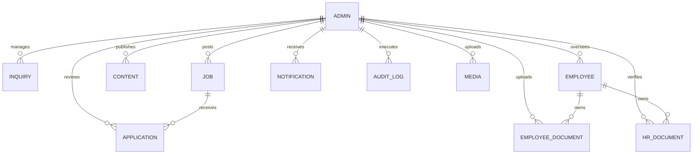

# DATABASE DESIGN & DATA ARCHITECTURE — ASHIVAM TECHNOLOGIES

**Target:** MongoDB (via Mongoose 9.x)  
**Database Name:** `ashivam_technologies`  
**Updated:** 2026-10-08  
**Classification:** Engineering Architecture Reference  

---

## 1. Architectural Overview

The Ashivam Technologies platform operates on a document-oriented database design implemented using MongoDB. The schema definitions balance relational integrity (referential keys with ObjectId references) with document immutability and high-throughput indexed queries for public website consumption and back-office management.

---

## 2. Collections & Schema Specifications

### 2.1. `admins` Collection (`models/admin.model.js`)
Stores authenticated administrative accounts with role-based access control.

| Field | Type | Modifiers / Rules | Description |
|---|---|---|---|
| `_id` | ObjectId | Primary Key | Unique document identifier |
| `username` | String | Required, Unique, Lowercase, Trim, min: 3, max: 50 | Unique login username |
| `name` | String | Required, Trim, max: 100 | Display name |
| `passwordHash` | String | Required, `select: false` | Bcrypt salt-hashed credential |
| `role` | String | Enum: `["Superadmin", "Admin"]`, default: `"Admin"` | High-level role |
| `permissions` | [String]| Array of privileged permission keys | Granular capability flags |
| `isActive` | Boolean | Default: `true` | Account active flag |
| `lastLoginAt` | Date | Default: `null` | Timestamp of last successful auth |
| `createdAt` / `updatedAt` | Date | Managed by Mongoose `timestamps: true` | Audit timestamps |

**Indexes:**
- `{ username: 1 }` (unique)
- `{ role: 1 }`
- `{ isActive: 1 }`

---

### 2.2. `inquiries` Collection (`modules/inquiry/inquiry.model.js`)
Captures inquiries submitted through the public contact forms.

| Field | Type | Modifiers / Rules | Description |
|---|---|---|---|
| `_id` | ObjectId | Primary Key | Unique inquiry identifier |
| `name` | String | Required, Trim, min: 2, max: 100 | Full name of requester |
| `email` | String | Required, Lowercase, Trim, max: 150 | Contact email address |
| `phone` | String | Trim, max: 20, default: `null` | Phone number |
| `subject` | String | Trim, max: 200, default: `null` | Topic of interest |
| `message` | String | Required, Trim, min: 10, max: 5000 | In-depth inquiry body |
| `status` | String | Enum: `["new", "in_progress", "resolved", "closed"]`, default: `"new"` | Workflow status |
| `adminNote` | String | Trim, max: 2000, default: `null` | Internal staff commentary |
| `assignedTo` | ObjectId | Ref: `"Admin"`, default: `null` | Assigned personnel |
| `resolvedAt` | Date | Default: `null` | Timestamp of resolution |

**Indexes:**
- `{ status: 1, createdAt: -1 }` (compound for triage pagination)
- `{ email: 1, createdAt: -1 }` (compound for user inquiry history)

---

### 2.3. `jobs` Collection (`modules/career/job.model.js`)
Stores company employment openings published on the careers portal.

| Field | Type | Modifiers / Rules | Description |
|---|---|---|---|
| `title` | String | Required, Trim, min: 2, max: 150 | Job role title |
| `slug` | String | Required, Unique, Lowercase, Trim | URL slug (e.g. `senior-full-stack-engineer`) |
| `department` | String | Required, Trim, max: 100 | Department (Engineering, Design, etc.) |
| `location` | String | Required, Trim, max: 150 | Physical/Remote location |
| `employmentType`| String | Enum: `["Full-time", "Part-time", "Internship", "Contract"]` | Contract type |
| `experience` | String | Trim, max: 100, default: `null` | Required years / level |
| `description` | String | Required, Trim, max: 10000 | Comprehensive job description |
| `requirements` | [String]| Array of requirement bullet points | Technical & soft skill prerequisites |
| `responsibilities`| [String]| Array of responsibility bullet points | Daily deliverables & expectations |
| `skills` | [String]| Array of keyword tags | Matching tech stack tags |
| `salary` | String | Trim, max: 100, default: `null` | Compensation band |
| `applicationDeadline`| Date | Default: `null` | Application closing timestamp |
| `isActive` | Boolean | Default: `true` | Public visibility toggle |
| `createdBy` | ObjectId | Ref: `"Admin"`, Required | Admin poster |

**Indexes:**
- `{ slug: 1 }` (unique)
- `{ isActive: 1, createdAt: -1 }`
- `{ department: 1, employmentType: 1 }`

---

### 2.4. `applications` Collection (`modules/career/application.model.js`)
Stores candidate job applications and resume metadata.

| Field | Type | Modifiers / Rules | Description |
|---|---|---|---|
| `job` | ObjectId | Ref: `"Job"`, Required | Linked job opening |
| `firstName` / `lastName` | String | Required, Trim, min: 2, max: 80 | Applicant name |
| `email` | String | Required, Lowercase, Trim, max: 150 | Applicant email |
| `phone` | String | Required, Trim, max: 20 | Applicant telephone |
| `resume` | Subdocument | `originalName`, `fileName`, `path`, `mimeType`, `size` | Stored resume metadata |
| `status` | String | Enum: `["applied", "under_review", "shortlisted", "rejected", "hired"]` | Pipeline state |
| `adminNote` | String | Trim, max: 2000, default: `null` | Review notes |
| `reviewedBy` | ObjectId | Ref: `"Admin"`, default: `null` | Reviewing officer |
| `reviewedAt` | Date | Default: `null` | Timestamp of review |

**Indexes:**
- `{ job: 1, createdAt: -1 }`
- `{ status: 1, createdAt: -1 }`
- `{ email: 1, createdAt: -1 }`

---

### 2.5. `internships` Collection (`modules/internship/internship.model.js`)
Captures student applications for university and industrial training programs.

| Field | Type | Modifiers / Rules | Description |
|---|---|---|---|
| `name` | String | Required, Trim, min: 2, max: 100 | Student name |
| `email` | String | Required, Lowercase, Trim, max: 150 | Email address |
| `phone` | String | Required, Trim, max: 20 | Contact number |
| `college` | String | Required, Trim, min: 2, max: 200 | Academic institution |
| `domain` | String | Required, Enum of supported tracks | Internship subject track |
| `duration` | String | Enum of durations, default: `null` | Duration (e.g. 3 Months, 6 Months) |
| `portfolio` | String | Trim, max: 300, default: `null` | Portfolio / GitHub URL |
| `status` | String | Enum: `["applied", "under_review", "accepted", "rejected", "completed"]` | Program status |

**Indexes:**
- `{ status: 1, createdAt: -1 }`
- `{ email: 1, domain: 1 }`
- `{ domain: 1, createdAt: -1 }`

---

### 2.6. `contents` Collection (`modules/content/content.model.js`)
Stores dynamic CMS content for website sections.

| Field | Type | Modifiers / Rules | Description |
|---|---|---|---|
| `key` | String | Required, Unique, Lowercase, Trim, min: 2, max: 100 | Section identifier key |
| `section` | String | Required, Lowercase, Trim, max: 50 | Category grouping |
| `title` | String | Required, Trim, max: 200 | CMS section header |
| `content` | Mixed | Required | Arbitrary structured JSON schema block |
| `status` | String | Enum: `["draft", "published"]`, default: `"draft"` | Publication lifecycle |
| `sortOrder` | Number | Default: `0` | Sequence ranking |

**Indexes:**
- `{ key: 1 }` (unique)
- `{ section: 1, status: 1, sortOrder: 1 }`
- Text Index: `{ title: "text", key: "text", section: "text" }`

---

### 2.7. `employees` Collection (`modules/employee/employee.model.js`)
Maintains the official employee and executive roster.

| Field | Type | Modifiers / Rules | Description |
|---|---|---|---|
| `firstName` / `lastName` | String | Required, Trim, max: 80 | Employee name |
| `email` | String | Required, Unique, Lowercase, Trim, max: 160 | Official email address |
| `designation` | String | Required, Trim, max: 120 | Job title |
| `department` | String | Required, Trim, max: 120 | Department name |
| `employmentType` | String | Enum: `["Full-time", "Part-time", "Contract", "Intern", "Freelance"]` | Contract category |
| `joiningDate` | Date | Required | Formal date of joining |
| `workLocation` | String | Enum: `["Office", "Remote", "Hybrid"]` | Work environment |
| `skills` | [String]| Array of skills | Tech & management skills |
| `socialLinks` | Object | `linkedin`, `github` | Professional profiles |
| `isFeatured` | Boolean | Default: `false` | Shown on homepage leadership block |
| `isActive` | Boolean | Default: `true` | Active status |
| `deletedAt` | Date | Default: `null` | Soft delete timestamp |

**Indexes:**
- `{ email: 1 }` (unique)
- `{ department: 1, isActive: 1 }`
- `{ designation: 1, isActive: 1 }`
- `{ displayOrder: 1, createdAt: -1 }`
- Text Index: `{ firstName: "text", lastName: "text", email: "text", designation: "text", department: "text" }`

---

### 2.8. `employeedocuments` Collection (`modules/employee-document/employee-document.model.js`)
Internal employee records (Offer Letters, Salary Slips, Experience Letters).

**Indexes:**
- `{ employee: 1, documentType: 1, status: 1 }`
- `{ createdAt: -1 }`

---

### 2.9. `hrdocuments` Collection (`modules/hr-document/hrDocument.model.js`)
Compliance documents with verification and expiration tracking.

**Indexes:**
- `{ employee: 1, documentType: 1 }`
- `{ status: 1, expiryDate: 1 }`
- `{ createdAt: -1 }`

---

### 2.10. `media` Collection (`modules/media/media.model.js`)
Media asset metadata, safe randomized file storage names, MIME types, and categories.

**Indexes:**
- `{ fileName: 1 }` (unique)
- Text Index: `{ originalName: "text", fileName: "text" }`

---

### 2.11. `notifications` Collection (`modules/notification/notification.model.js`)
In-app administrative notifications with unread badges and delivery timestamps.

**Indexes:**
- `{ recipient: 1, isRead: 1, createdAt: -1 }`
- `{ recipient: 1, createdAt: -1 }`

---

### 2.12. `auditlogs` Collection (`modules/audit/audit.model.js`)
Activity audit trails recording actor, IP address, user agent, target entity, and modifications.

**Indexes:**
- `{ createdAt: -1 }`
- `{ "actor.userId": 1, createdAt: -1 }`
- `{ entity: 1, action: 1, createdAt: -1 }`

---

### 2.13. `settings` Collection (`modules/settings/settings.model.js`)
Global site settings singleton (`key: "global"`), business hours, social links, SEO metadata, and maintenance switches.

**Indexes:**
- `{ key: 1 }` (unique)

---

## 3. Data Integrity & Query Optimization Guidelines

1. **Pagination Standard:**
   All listing endpoints execute bounded queries using `Math.max(Number(page) || 1, 1)` and `Math.min(Math.max(Number(limit) || 20, 1), 100)`.
2. **Projections & Lean Queries:**
   Read operations intended for API responses utilize `.lean()` to bypass Mongoose hydration overhead and `.select()` to exclude heavy or sensitive properties (e.g. `passwordHash`).
3. **Regex Search Optimization:**
   All user query strings passed into `$regex` must first be escaped via `escapeRegex` from `backend/src/utils/query.js` to guard against ReDoS attacks.
4. **Soft Deletions:**
   High-value business objects (`Employee`, `HRDocument`) implement soft deletion patterns (`isActive: false` or `deletedAt: new Date()`) to protect against catastrophic accidental data loss.
